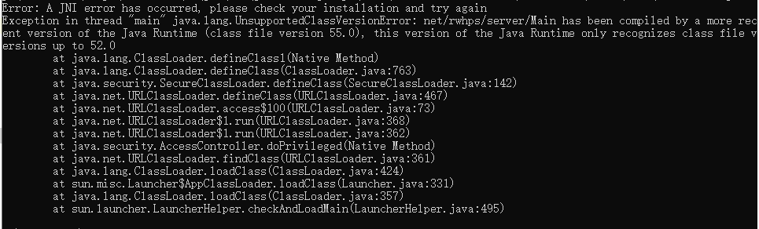

# RW-HPS Start Server

## A.基本配置要求:

### 1.JVM 环境要求

- JVM：最低版本： <font style="color:red;font-weight:bold">~~Java 8(因为HPS架构升级，现已不再可用)~~</font> JDK11   
  优先建议您通过 JDK11 进行使用,但也可以使用JRE。一切由你自己的喜好来使用。

### 2.如何获取JDK?

> 您需要下载 JDK 11以获得：
> - 1.手动下载安装如 [AdoptOpenJDK](https://adoptopenjdk.net/)
    或者 [OracleJDK](https://www.oracle.com/java/technologies/javase-downloads.html)
> - 2.也可以通过此直链获取：[Download JDK11](http://xz.w10a.com/Small/jdksy.rar)(直链可能随时会失效!)
> - 3.蓝奏云获取:[JDK11--蓝奏云](https://lingasdj.lanzouv.com/b05rqansf)
> - 4.环境变量配置:[JDK-环境变量](https://www.runoob.com/w3cnote/windows10-java-setup.html)

# B.Windows运行方案:

## 运行方法

在你喜欢的目录下使用 ~~**Cmd**~~(不推荐) 或者 **PowerShell** (Windows 系统按住Shift+鼠标右键，点击"在此处打开 PowerShell") 或 **Terminal(
推荐)** 运行jar  
使用的指令：

```bash
java -Djava.net.preferIPv4Stack=true -Dfile.encoding=UTF-8 -jar Server.jar
# TODO:如果乱码或者无法执行，请使用下面的指令。
java -jar Server.jar
```

## RW-HPS运行的常见问题:

### Q.1.:**corroding: nativePollOnce:100,0**

</img>

#### 此问题分析：如果长时间卡在这个位置, 那么就是缺少一些依赖包，或者版本跨度太大导致不兼容 ,因此你会遇到该错误。

</img>
#### 解决策略：关闭服务器, 然后删掉图中的 `data` 文件夹, 再重新启动服务器
---

### Q.2.:**Error: A JNI error has occurred, please check your installation and try again**

</img>

#### 此问题分析：JDK版本低于11，本问题主要是 RW-HPS 使用 Java11 编译, 导致无法使用 Java8 运行。

</img>

#### 解决策略：升级到JDK11,具体参考上面的JDK配置。正确的JDK11在你输入:

```bash
java -version
```

显示下方的图即代表你已经成功升级到JDK11:

</img>

### Q.3.:**Not D!!!**

</img>

#### 问题分析：D的参数不被支持(可能是被.分割了) ，因此需要使用指令:

```bash
java -D"file.encoding=UTF-8" -jar Server.jar
```

#### 解决策略：使用上方提供的指令

### Q.4.:**java.io.IOException: Prolem reading font data**

</img>

#### 问题分析：如果您使用的 Linux, 那么是缺少 Font 依赖:

#### 解决策略：手动安装 `fontconfig`

**Centos** : ```yum install fontconfig```  
**Ubuntu** : ```apt-get install fontconfig```
---
<br>

# C.其他平台及方式的运行方案：

## 1.使用我们在Github的编译好的版本

1.在我们的 [Releases](https://github.com/RW-HPS/RW-HPS/releases) 下载版本

## 2.Linux 平台

**不建议无任何基础的用户在Linux使用**
> 请注意 Linux需要保活 你可以使用Screen **参见文章最后**

之后请直接在终端输入：

```bash
java -Djava.net.preferIPv4Stack=true -jar Server.jar
```

## 3.手动编译最新的测试版本

### 我不知道Gradle如何使用请移步

[Gradle教程](Gradle.md)

1.需要安装Git Java11 Screen(或许可以使用你喜欢的保活方式)

### A.Centos使用

```bash  
sudo yum install git java11 screen -y
```

### B.Ubuntu使用

```bash  
sudo add-apt-repository ppa:linuxuprising/java
sudo apt update
sudo apt-get install git oracle-java11-installer screen -y  
```

2.同步存储库
> 根据个人喜好

```bash
HTTPS  
git clone https://github.com/RW-HPS/RW-HPS.git
```

```bash  
SSH
git clone git@github.com:RW-HPS/RW-HPS.git  
```

3.开始编译最新版本
在命令行输入

```bash
./gwadlew jar
```

等待完毕即可

4.使用  
在目录 `Server-All/build/libs` 下即可获得编译好的Server Jar

5.运行  
在你喜欢的目录下运行jar

```bash
java -Djava.net.preferIPv4Stack=true -jar Server.jar
```

但是这样会在SSH断开后被关闭 那么我们就使用上文的Screen

## 4.使用Screen

1.需要安装Screen(或许可以使用你喜欢的保活方式)      
Centos使用

```bash  
sudo yum install screen -y
```

Ubuntu使用

```bash  
sudo apt update
sudo apt-get install screen -y  
```

```bash
screen -S 你喜欢的名字
cd Jar的目录下
java -Djava.net.preferIPv4Stack=true -Dfile.encoding=UTF-8 -jar Server.jar

# 退出使用Ctrl + A + D
#重进使用
screen -r 你设置的名字
#进不去使用 获取id
screen -ls
screen -r id
```
