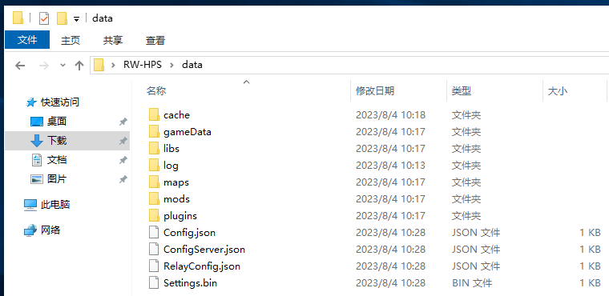

# 配置服务端

我们现在来配置服务端吧！

打开与服务端文件同一个目录下的`data`文件夹

不要看着这一堆文件夹和文件着急，我们这次只需要使用其中的3个就行了

首先，在服务端运行的时候是不能修改配置的，就算修改了也不会起作用

我们在服务端控制台里输入`exit`来退出它

之后，我们右键选择**打开方式**

我们依然选择记事本打开(那个勾可选可不选)

打开后，你可能会看不懂，不过[这里](/run/Config.md#配置服务器)有配置文件的解释

我们参照解释配置好服务端，就可以关掉记事本啦

> 不要问我要不要保存这种低级问题啦，笨蛋！

`Config.json` `ServerConfig.json` `ConfigRelay.json`都是可以编辑的哦

下一章: [安装模组/地图](InstallModsOrMaps.md#安装模组地图)
