# 下载并安装 Java

## 获取 Java 安装程序

首先呢，你要先安装一个叫做 **Java** 的东西，没有它，服务端就不能运行起来

下载链接: [Java 11](http://mirrors.ustc.edu.cn/adoptium/releases/temurin11-binaries/LatestRelease/OpenJDK11U-jdk_x64_windows_hotspot_11.0.20_8.msi)

使用浏览器打开链接之后，它应该就开始下载啦

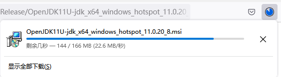

(你的下载界面可能和我的不一样，不过没关系，能下载就行)

下载完成之后点击就能打开，如果没有，去下载目录找找看吧

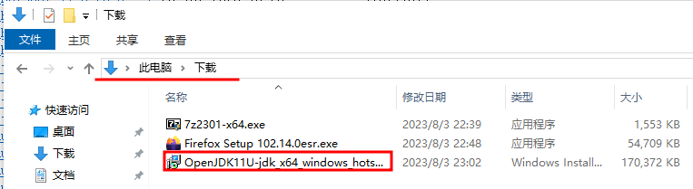

看，我们抓住它了

不过嘛，你的浏览器可能会给你一个*善意的提示*

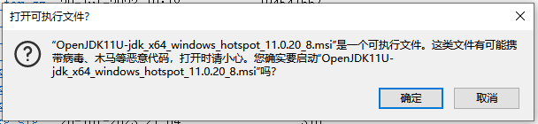

不要慌，Java *不是*病毒，我们只需点击**运行**就能打开 Java 安装程序啦

## 安装 Java

我们点击**运行**之后呢，它会弹出一个窗口，就是这个窗口

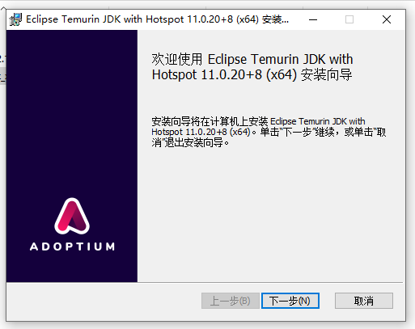

我们点击**下一步**

接下来呢，我们要更改一些东西

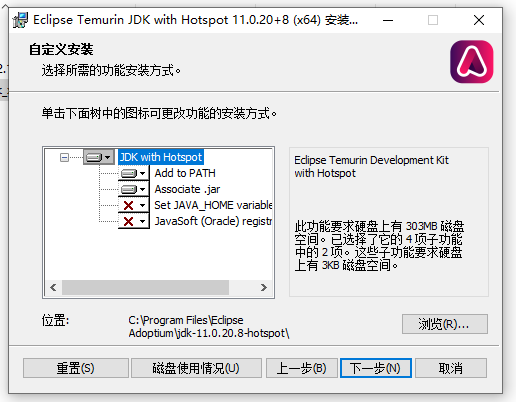

点一下红色的那个小叉叉(不是右上角那个哦)，然后它会弹出这个可爱的小列表

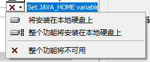

用鼠标左键点一下第二个，也就是**整个功能将安装在本地硬盘上**

第四个JavaSoft (Oracle) reg什么什么的也是这样

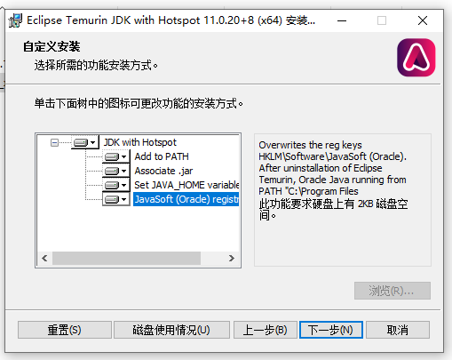

直到像我图片里的这样，我们就可以愉快地点击**下一步**啦

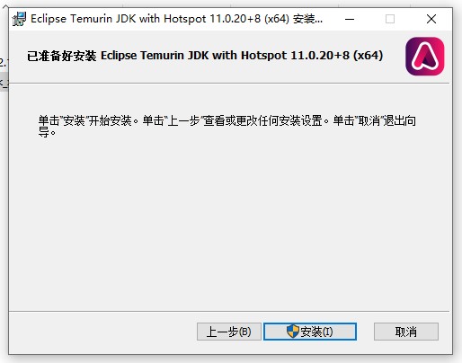

OK，接下来我们点击**安装**，此时，Windows 会弹出一个覆盖整个屏幕的窗口，问你同不同意

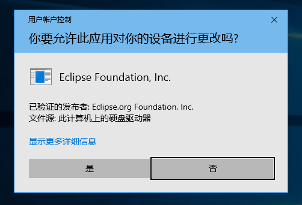

这不是废话嘛，当然选左边的那个**是**啦

然后它就开始跑进度条了，这时候我们只需倒点咖啡~~抽一支烟~~好孩子不能抽烟哦，耐心等待就行了

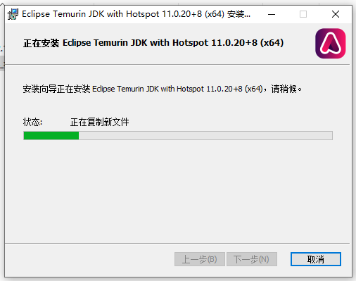

~~Ten years later...~~


## 完成 Java 安装

我来给你变个魔术吧，你点击那个**完成**按钮，窗口就会消失

~~怎么样，神不神奇~~

到了这步，Java 就算安装完成了，我们要怎么知道它到底装没装上呢？

我们只需要按<kbd>Win</kbd>+<kbd>R</kbd>，就会弹出一个窗口

> 什么？你问我<kbd>Win</kbd>按钮在哪里？
>
> 就是你键盘左下角那个四个方块组成的按键啦
>
> 先按住<kbd>Win</kbd>不松手，然后再按下<kbd>R</kbd>就行了

然后在那个神奇的小窗口里输入`cmd`，点击**确定**

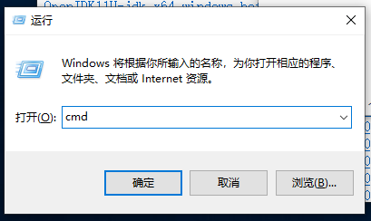

之后我们在这个黑乎乎的窗口里输入`java -verison`(注意中间有空格哦)

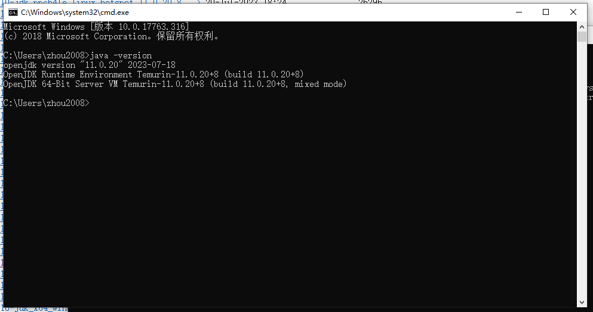

正常来说它会输出类似这样的东西

```
openjdk version "11.0.20" 2023-07-18
OpenJDK Runtime Environment Temurin-11.0.20+8 (build 11.0.20+8)
OpenJDK 64-Bit Server VM Temurin-11.0.20+8 (build 11.0.20+8, mixed mode)
```

那你现在就可以前往下一章: [下载并运行服务端](DownloadAndRunServer.md#下载并运行服务端)


如果你看到了

```
'java' 不是内部或外部命令，也不是可运行的程序或批处理文件。
```

那就表明你在之前的 [安装 Java](#安装-Java) 过程中没有认真听

罚你重装一遍 Java

哼
