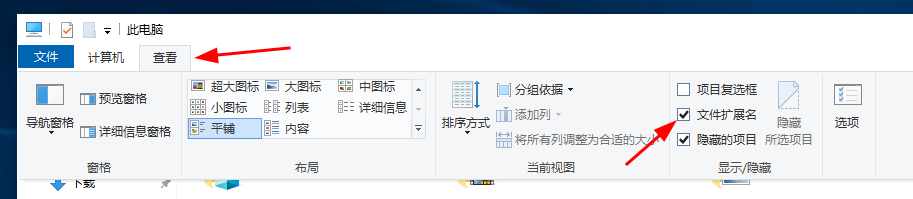

# 下载并运行服务端

首先，你要确保你的网络能**正常访问** Github 哦

## 下载服务端

好的，我们在[上一章](DownloadAndInstallJava.md)已经成功安装了 **Java**，那么接下来

我们就来下载 **RW-HPS** 服务端

点击[这个](github.com/RW-HPS/RW-HPS)链接，你会跳转到 RW-HPS 的 Github 项目主页


然后往下滑，找到**Releases**


看到那个蓝色的字了吗？就是写着`+ 23 releases`的那个，*23*在你那里可能是别的数字，不用管这些，点进去就行啦


是不是看到中文又亲切了一点？

找到你想下载的服务端版本，然后点击下面的那个**Assets**，它会弹出一个小列表


介绍一下: `.patch`结尾的是差异文件，我们不需要关心它，而那个`.jar`结尾的就是服务端本体啦，点一下就能下载的说

> 看到这里，你可能会好奇`.patch`文件的用处？
>
> 它就是你在服务端运行`tryupdate`命令的时候会下载的那个文件
>
> 比重新下载`.jar`快多了(毕竟不到1M的大小)

后面那两个是源代码~~对你可能没什么用~~

## 给服务端找个家


看到这个孤零零的服务端，你肯定不想让它~~她~~待在这*下载*文件夹吧

我们在桌面(其他地方也行，你喜欢就好)上新建一个文件夹

叫什么名字呢......就叫`RW-HPS`吧


然后把`Server-All.jar`(就是在*下载*文件夹里的那个)放到这个文件夹里边去


就像这样

## 编写启动脚本

现在，我们就来编写它的启动脚本吧！

> 诶诶诶先别双击它启动，是没有用的

别看到*编写*这两个字就被吓到了，我们要做的只是复制粘贴，仅此而已

我们先让 Windows 显示文件扩展名



之后再复制一下这些文字

```bat
@echo off
java -jar Server-All.jar
pause
```

然后呢，右键选择**新建文本文档**，就像这样


> 什么？你问我选哪个？眼睛不会看嘛，最后那个就是啦，笨蛋！


我们把它的名字改成`start.bat`

或者取个你喜欢的名字，只要最后面是`.bat`就可以了

重命名完成后，我们用鼠标右键点击它


Windows 会弹出这个菜单，我们选择第二项，也就是**编辑**

然后就会弹出一个*记事本*

这时，我们把上文复制的内容粘贴进去就行啦


粘贴完之后就可以点一下右上角的关闭按钮了


它问我们要不要保存，这不是废话嘛，我们点击左边的**保存**按钮

## RW-HPS，启动！

之后呢，我们双击打开这个`start.bat`

服务端就开始启动啦

启动的过程中，会出现这种情况


这是在问你同不同意它的**EULA**(**最终用户协议**)，我们在这个黑乎乎的窗口里输入`Yes`(不分大小写)


这时候呢，它会自动开始下载所需的依赖啦

我们只需耐心等待即可


有时候，Windows 的防火墙会出来提醒你，我们把那两个勾全勾上，点击**允许访问**


现在 RW-HPS 就启动完成了

你只需把你的 IP 地址发给你的小伙伴就能愉快的玩游戏啦！


你可能想要配置一下服务端？[点我点我](ConfigureServer.md#配置服务端)
