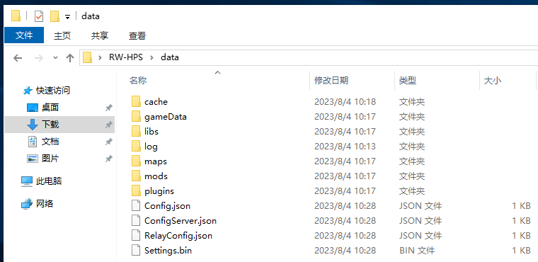

# 安装模组/地图

厌倦了铁锈原版的地图？想安装模组？

详情请参见下文

## 安装文件

和配置服务端一样，需要先关闭服务端才能安装

还记得上一章所说的`data`文件夹吗？

这次我们需要把模组放入`mods`文件夹(后缀名要`rwmod`哦)

地图放入`maps`文件夹(`.save`文件也可以哦)

## 切换地图

在客户端聊天框输入 `.maps` 我们就可以查看到服务器生效的地图了哦

同时我们可以在每个名字前发现一个数字 ID

在客户端聊天框输入 `.map+空格+ID` 我们就可以切换到自定义地图啦

**注意 切换地图后房主的地图显示可能会有问题 是正常的 不需要动**  
**如果需要切回原版 那么在房主的原版地图挑一个就好了**

然后就可以啦！

下一章: [安装插件](InstallPlugins.md#安装插件)

