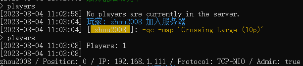
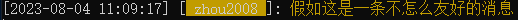
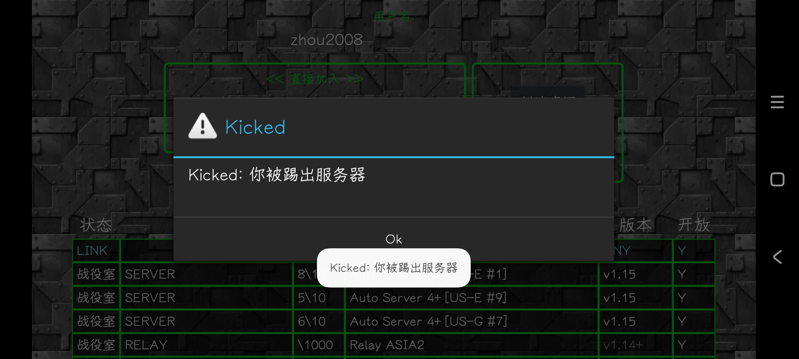

# 管理服务器

在我们服务器的可能会遇到一些*不怎么友好的玩家*/*不怎么友好的玩家名*

我们该如何解决呢？

## 获取玩家ID

要对玩家进行操作，我们首先需要获取这个玩家的ID(不是玩家名哦)

我们在控制台里输入`players`之后就会出现类似这样的内容

我们要看这个玩家位于列表的第几位，比如这个玩家的ID就是`1`

有了这个ID我们就可以对玩家进行操作啦

## 踢出玩家

在控制台使用`kick`命令可以踢出玩家

这个命令有两个参数，第一个是玩家ID，第二个是时长(单位是秒)

时长可写可不写

比如这个玩家发送了一条不怎么友好的消息

我们就可以使用`kick 1`来把他踢掉

客户端效果

## 封禁玩家

使用`ban`可以封禁玩家，使用方法与`kick`相同，只有一个参数

> 未完待续...